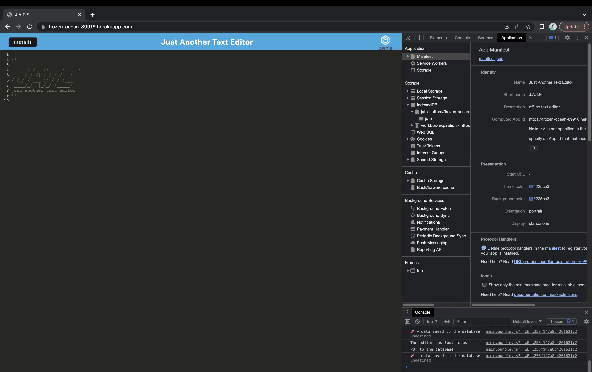
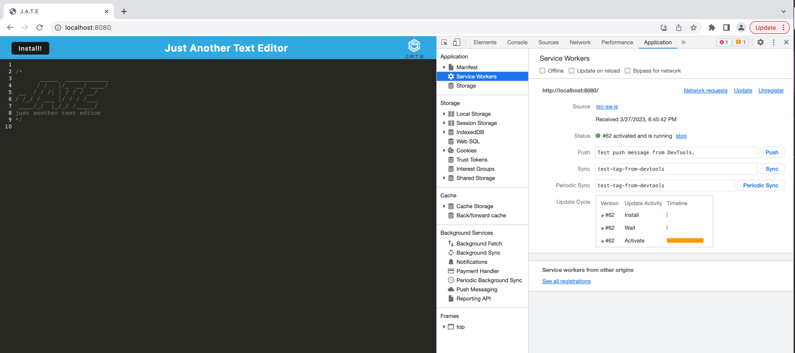
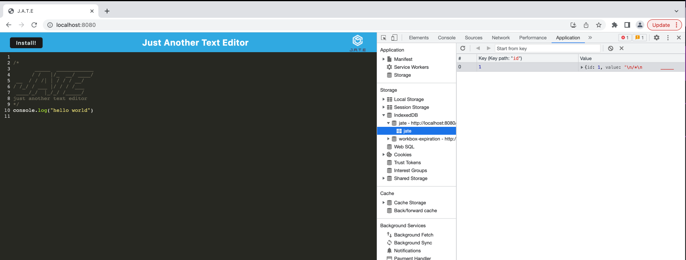

# M19-Text-Editor-DPB

## Description

J.A.T.E is a Progressive Web Application (PWA) that runs in the browser, and even offline or it can be installed locally to your machine. This application features a number of data persistence techniques that serve as redundancy in case one of the options is not supported by the browser. J.A.T.E uses an IndexedDB database and the idb package.

## Table of Contents
1. [Description](#description)
2. [Table of Contents](#table-of-contents)
3. [Usage](#usage)
4. [Installation](#installation)
5. [Screenshots](#screenshots)
6. [License](#license)
7. [Technologies Employed](#technologies-employed)


## Usage
### User Story

```md
AS A developer
I WANT to create notes or code snippets with or without an internet connection
SO THAT I can reliably retrieve them for later use
```

### Acceptance Criteria 

```md
GIVEN a text editor web application
WHEN I open my application in my editor
THEN I should see a client server folder structure
WHEN I run `npm run start` from the root directory
THEN I find that my application should start up the backend and serve the client
WHEN I run the text editor application from my terminal
THEN I find that my JavaScript files have been bundled using webpack
WHEN I run my webpack plugins
THEN I find that I have a generated HTML file, service worker, and a manifest file
WHEN I use next-gen JavaScript in my application
THEN I find that the text editor still functions in the browser without errors
WHEN I open the text editor
THEN I find that IndexedDB has immediately created a database storage
WHEN I enter content and subsequently click off of the DOM window
THEN I find that the content in the text editor has been saved with IndexedDB
WHEN I reopen the text editor after closing it
THEN I find that the content in the text editor has been retrieved from our IndexedDB
WHEN I click on the Install button
THEN I download my web application as an icon on my desktop
WHEN I load my web application
THEN I should have a registered service worker using workbox
WHEN I register a service worker
THEN I should have my static assets pre cached upon loading along with subsequent pages and static assets
WHEN I deploy to Heroku
THEN I should have proper build scripts for a webpack application
```

## Installation
This application is deployed to [Heroku](https://frozen-ocean-89916.herokuapp.com/).

To run J.A.T.E locally:

1. Clone repo from Github
2. Run `npm install` to install dependencies
3. Run with `npm start`

## Screenshots

 ```manifest.json``` file:



Registered service worker:




IndexedDB storage:




## License
This project is licensed under the MIT license.

A short and simple permissive license with conditions only requiring preservation of copyright and license notices. Licensed works, modifications, and larger works may be distributed under different terms and without source code.<p/>For more information visit [MIT Licensing](https://choosealicense.com/licenses/mit/).

## Technologies Employed
* Concurrently
* JavaScript
* IndexedDB
* Express
* NodeJS
* Babel
